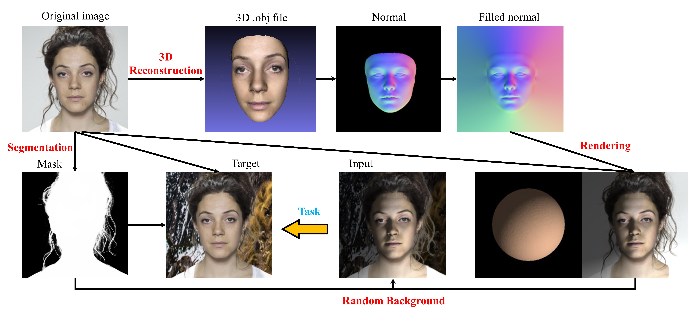
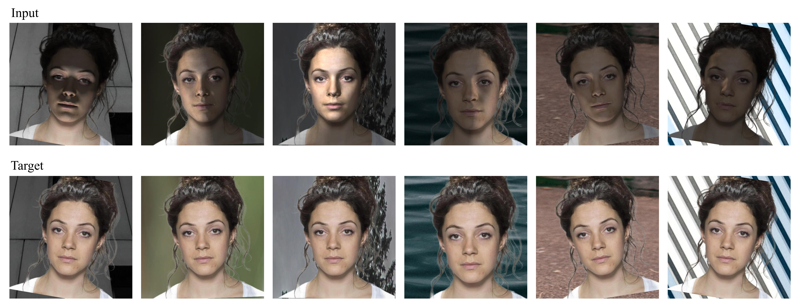

# face-light-rendering-for-face-image-enhancement

This repository shows how to synthesize face images with poor lighting conditions. The virtual dataset can be used for face image enhancement.  Training code: https://github.com/leolya/face-image-light-enhancement

## Pipeline

## Visualization

